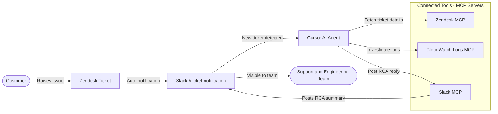

# AI-Powered Ticket RCA Automation

## Overview

We have set up an automated system that performs an AI-powered Root Cause Analysis (RCA) the moment a new support ticket appears. Our internal team no longer needs to manually dig through tickets, logs, and chat history to understand what went wrong. The AI does the first level of investigation automatically and shares its findings in Slack.

The goal is simple:

- Reduce time to first response on every ticket
- Give the support and engineering team a ready-made RCA summary
- Keep all stakeholders informed in the same channel where they already work

---

## Visual Flow

The diagram above shows how a customer ticket flows through our automation and ends as a clear RCA summary back in Slack — without any manual step in between.

---

## How It Works (In Simple Terms)

The setup connects three systems together through an AI assistant running inside Cursor:

1. Slack
2. Zendesk
3. AWS CloudWatch Logs

These three are connected to the AI agent. Whenever something happens in one of them, the AI can read information from all three and act intelligently.

### Step-by-Step Flow

1. A customer raises a ticket in Zendesk.
2. A notification about that ticket automatically appears in the dedicated Slack channel called `ticket-notification`.
3. The AI agent monitors this Slack channel.
4. As soon as the new ticket message is detected, the AI agent starts the analysis automatically.
5. The AI agent does the following work on its own:
   - Reads the full ticket details from Zendesk (description, customer message, priority, history)
   - Searches the relevant CloudWatch logs for the same time window the issue happened
   - Looks for errors, failures, patterns, or anomalies
   - Correlates information across services if needed
6. Once the analysis is complete, the AI posts a clear, human-readable RCA summary back into Slack as a reply to the ticket notification.

The customer-facing team and engineers see the RCA in Slack within minutes, without anyone manually triggering anything.

---

## What the RCA Report Contains

Each RCA reply in Slack typically includes:

- A short summary of what the customer reported
- The most likely root cause based on logs and ticket context
- Supporting evidence (relevant log snippets, error patterns, timestamps)
- Severity and impact assessment
- Suggested next steps for the engineering team

This means anyone reading the Slack thread instantly understands:

- What happened
- Why it happened
- What to do next

---

## Why This Matters for the Business

- **Faster response time**: Analysis starts the second a ticket is created.
- **Consistent quality**: Every ticket gets the same structured RCA format.
- **Less manual work**: Engineers do not need to start from scratch.
- **Better customer experience**: Issues get diagnosed and acted upon faster.
- **Centralized visibility**: All RCAs land in one Slack channel for the whole team.

---

## Components Used

| Component | Purpose |
|----------|---------|
| Cursor AI Agent | Brain of the automation. Performs reasoning and orchestrates the work. |
| Slack Connector | Reads new ticket notifications, posts RCA replies. |
| Zendesk Connector | Pulls full ticket information for context. |
| CloudWatch Logs Connector | Investigates application logs for the issue window. |

These connectors are MCP (Model Context Protocol) servers. They allow the AI agent to securely talk to each system in a controlled way, only doing what we have permitted.

---

## Security & Control

- The AI agent only acts when a new ticket message is posted in the designated channel.
- It only reads logs and ticket data; it does not modify or delete anything.
- Slack messages are only posted to the agreed RCA channel.
- All access is gated through credentials we manage on our infrastructure.

---

## Example Flow (Real-World Scenario)

1. A customer reports: *"Image generation failed on my product page."*
2. Ticket gets created in Zendesk.
3. Notification arrives in `#ticket-notification` Slack channel.
4. AI agent automatically:
   - Reads the ticket
   - Pulls CloudWatch logs from the relevant Lambda function for that time
   - Detects a recurring `TimeoutError` and links it to the same image generation service
5. AI posts in Slack:
   > **RCA Summary**
   > Customer reported failure in image generation.
   > Cause: Lambda function `ImageGenerationTryOnFn` hit timeout while invoking the image service.
   > Evidence: 14 timeout errors in the last 30 minutes.
   > Suggested next step: Increase timeout, inspect downstream service health.

The team now has actionable insight in minutes.

---

## In Summary

We have built a self-running RCA assistant. It listens for new tickets, investigates across our systems, and reports back in Slack — without manual intervention. This dramatically reduces the time and effort needed to understand and act on customer-reported issues.
